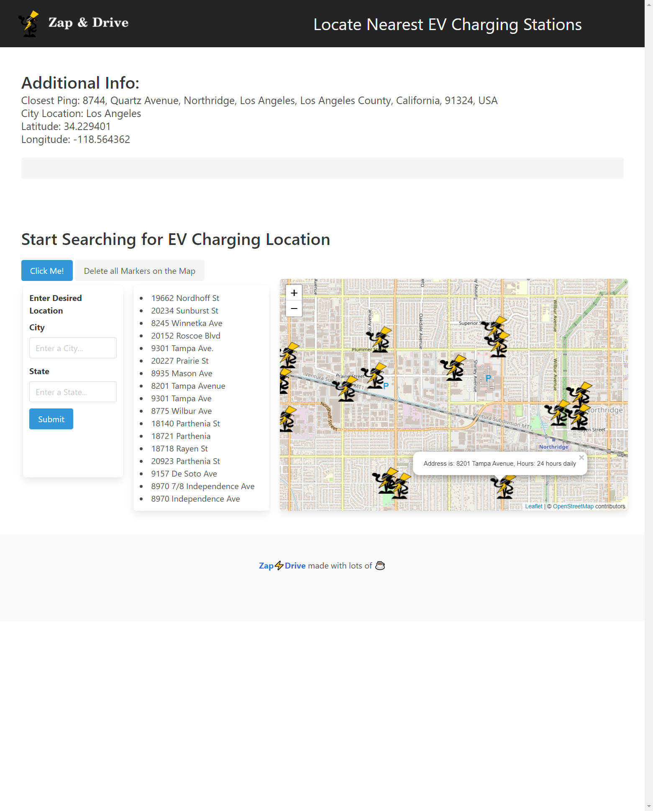

# ⚡Zap and Drive⚡

### An app that lists the EV charging locations across United States.

:computer: **Github Repository**: https://github.com/jwilferd10/Zap-and-Drive

:computer: **Live Example**: https://jwilferd10.github.io/Zap-and-Drive/

## :open_file_folder: Table of Contents:
  - [Preview](#camera-preview)
  - [Demo](#movie_camera-demo)
  - [Description](#wave-description)
  - [User Story](#book-user-story)
  - [Resources Used](#floppy_disk-resources-used)
  - [Contributors](#paperclip-contributors)
  - [Getting Started](#minidisc-getting-started)
  - [Contact Information](#e-mail-contact-information)

## :camera: Preview:

## :wave: Description: 
### :zap: Locate, Navigate, and Charge

Did you know that the United States is actively promoting the adoption of EVs as part of its broader strategy to combat climate change and reduce greenhouse gas emissions? An ambitious goal has been set for EVs to account for 50% of new vehicle sales by 2030. 
[Learn More](https://www.wri.org/insights/biden-administration-tracking-climate-action-progress)

As electric cars continue to gain traction within the United States, the need for convenient EV charging stations has never been greater. Zap and Drive is here to help with that, designed to simplify the search for nearby stations by providing users with essential data such as location, hours, and availability.

### :rocket: Features:
- Optimized interface for easy user access
  - Utilizes Bulma
  - Adjusted for both desktop and mobile devices
- Address List containing nearby stations
  - Clicking/Tapping on an address will zone users to that specific location
- Interactive map icons
  - Designates a charging station
  - When clicked, presents users with information about the charging station
 
### 💭 Developer Notes:
Future plans for this project include:
- Auto-completing potential states a city-name is located in
- Save addresses on a list and allowing users to populate the map with saved addresses

### 🙏 Thank You!
So much for viewing Zap and Drive, we hope this application can be useful in any way possible. Thank you again, happy coding! 

## :book: User Story:
(Coming Soon!)

## :floppy_disk: Resources Used:
- HTML
- CSS
- JavaScript
- Bulma
- Locations IQ (For geolocation and user input)
- openchargeMap (For EV charger locations)
- leaflet.js and openstreetmap (Utilizing the map)

## :minidisc: Usage:
Locating charging stations is a simple and straightforward process.
- Searches are currently limited to US states
- Fields marked with an asterisk (*) are required
- For most accurate results, please include a state in your search criteria
- Clearing markers will also reset the map.

Additional Notes:
- When a search is successful, this will automatically clear the map
- Notifications under the map may help guide users

## :paperclip: Contributors
 - Arlon Tuazon (API Selection and Implementation, Base JS Configuration, JS Development)
 - Jonathan Wilferd (Front-End and Logo design, JS Development)
  
## :e-mail: Contact Information:
(Coming Soon!)
